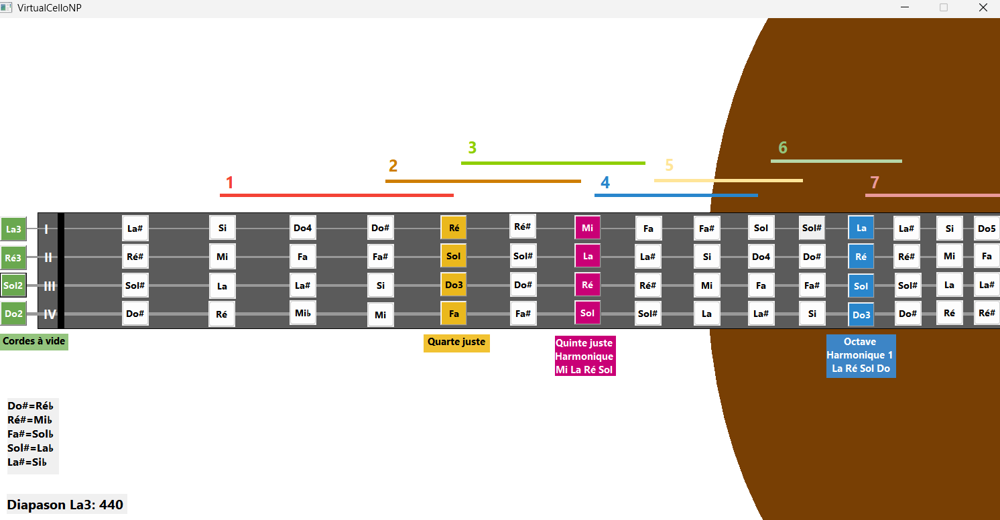

# VirtualCelloNP

VirtualCelloNP (Notes & Positions) est un petit logiciel pédagogique gratuit destiné aux professeurs et élèves de violoncelle.

## Démo vidéo
👉 Télécharger / voir la vidéo  et cliquer sur View  raw:
[demo VirtualCelloNP](Demo_VirtualCelloNP.mp4)

## Téléchargement direct pour Windows 

[➡ Télécharger VirtualCelloNP 1.0](https://github.com/jeanlouis769/VirtualCelloNP/releases/download/v1.0/Setup_VirtualCelloNP.exe)

## Fonctions

- Manche virtuel de violoncelle
- Repérage des notes
- Repérage des positions
- Écoute des notes et les intervalles
- Interface simple et légère

## Utilisation

Cliquer sur une note et elle sera jouée en pendant deux secondes.
Le son est directement interrompu si une autre note est jouée.

## Installation

#Important – Antivirus et droits administrateur.
VirtualCelloNP est un petit logiciel pédagogique indépendant distribué gratuitement et sans signature numérique officielle.
Certains antivirus, notamment Norton, peuvent effectuer une analyse de sécurité lors du lancement du programme d’installation. Pendant cette vérification, l’installation peut sembler momentanément interrompue. Il suffit d’attendre la fin de l’analyse pour que le processus continue normalement.
Selon la configuration de Windows ou de l’antivirus, un message peut également demander l’exécution du programme avec les droits administrateur. Dans ce cas :

- cliquer avec le bouton droit sur le fichier d’installation
- choisir : "Exécuter en tant qu’administrateur"

1. Télécharger :
   Setup_VirtualCelloNP.exe

2. Exécuter le programme d'installation.

3. IMPORTANT: Si Windows Defender affiche un avertissement :

- cliquer sur :
  Informations complémentaires

- puis :
  Exécuter quand même

## Version

Version actuelle :
1.0   pour Windows 11

## Auteur

Jean-Louis Van Cutsem

